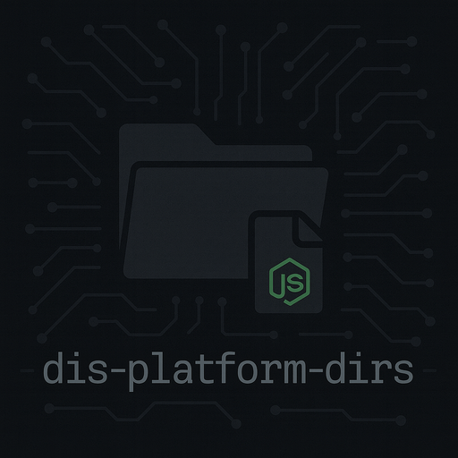

# dis-platform-dirs

 

Dependency-free, cross-platform user directory resolver for Node.js and Bun.  
Inspired by Python’s [`platformdirs`](https://pypi.org/project/platformdirs/).

## Install

```bash
bun add dis-platform-dirs
# or
npm install dis-platform-dirs
```

## Overview

This module provides consistent paths for storing user-specific application data, config files, cache, logs, and runtime data across Linux, macOS, and Windows. All logic is based on environment variables and standard platform conventions.

## API

```ts
/**
 * Returns the directory for user-specific application data.
 * - Linux: $XDG_DATA_HOME or ~/.local/share/<app>
 * - macOS: ~/Library/Application Support/<app>
 * - Windows: %APPDATA%\<author>\<app>
 */
function userDataDir(app: string, author?: string): string;

/**
 * Returns the directory for configuration files.
 * - Linux: $XDG_CONFIG_HOME or ~/.config/<app>
 * - macOS: ~/Library/Preferences/<app>
 * - Windows: %APPDATA%\<author>\<app>
 */
function userConfigDir(app: string, author?: string): string;

/**
 * Returns the directory for user cache files.
 * - Linux: $XDG_CACHE_HOME or ~/.cache/<app>
 * - macOS: ~/Library/Caches/<app>
 * - Windows: %LOCALAPPDATA%\<author>\<app>\Cache
 */
function userCacheDir(app: string, author?: string): string;

/**
 * Returns the log directory.
 * - Linux: <cache_dir>/logs
 * - macOS: ~/Library/Logs/<app>
 * - Windows: <cache_dir>\Logs
 */
function userLogDir(app: string, author?: string): string;

/**
 * Returns the runtime directory path.
 * - Linux: $XDG_RUNTIME_DIR if defined
 * - macOS and Windows: returns null
 */
function runtimeDir(): string | null;
```

## Example

```ts
import {
  userLogDir,
  runtimeDir,
  userDataDir,
  userCacheDir,
  userConfigDir,
} from "dis-platform-dirs";

const app = "dis-platform-dirs";
const author = "DefendITSolutions";

console.log("Data:", userDataDir(app, author));
console.log("Config:", userConfigDir(app, author));
console.log("Cache:", userCacheDir(app, author));
console.log("Logs:", userLogDir(app, author));
console.log("Runtime:", runtimeDir());
```

## Contributing

Contributions are welcome! To contribute:

1. **Fork** the repository.

2. **Create a new branch**:

   ```bash
   git checkout -b feature/my-feature
   ```

3. **Develop your changes**, using Bun’s built-in test runner and following the platform-specific test structure.

4. **Run tests** on your platform:

   ```bash
   bun run test:darwin   # or test:linux / test:win32 depending on your OS
   ```

5. **Ensure 100% coverage** on your platform:

   ```bash
   bun run coverage
   ```

   `/* c8 ignore next */` statements must be adjusted to reflect only the branches not reachable on your OS.

6. **Submit a pull request** with a clear description and associated tests.

> *Note*: All contributions must comply with the [MIT License](#license) and cannot contain any runtime dependencies.

## License

[MIT License](./LICENSE.md) 

© 2025 Defend I.T. Solutions LLC
